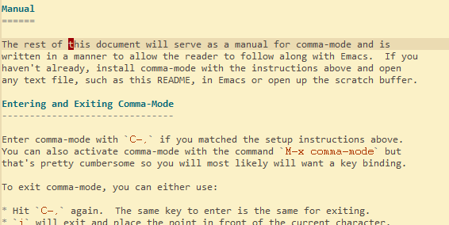

comma-mode
==========

A modal editing minor-mode designed with Emacs in mind.

Overview
--------

Comma-mode is minor mode for Emacs that defines a single key map to
facilitate fast modal editing.  Most of the modal commands our derived
from key bindings that come with a standard Emacs installation.  For
example, `C-f` is bound to `f` in the comma-mode key map to move
forward a character.  This allows to use the same mnemonics that one
has learned from vanilla Emacs to navigate a buffer but without always
having to hold down the control key.

Setup
-----

Place `comma-mode.el` in the `lisp` folder in your `.emacs.d`
directory.  Then add the following somewhere in your `init.el` file:

```
(require 'comma-mode)

```

By default comma-mode does its best to not interfere with your emacs
setup as you need to manually activate it.  The first thing that you
will want to do is assign a key to activate comma-mode while in a
Emacs buffer.  For example, I use the following:

```
(global-set-key (kbd "C-,") 'comma-mode)
```

This sets the control plus the comma key to the global key map to
activate comma-mode (hence the name).  Of course, when you visit a
buffer comma-mode will not automatically activate.  This is to
facilitate learning comma-mode incrementally but soon you may want to
have comma-mode activate automatically when you visit certain buffers.
For example, I have the following in my `init.el` file for when I
visit a buffer that is a text, programming language, or org file:

```
(dolist (hook '(emacs-lisp-mode-hook
                org-mode-hook
                prog-mode-hook
                text-mode-hook))
  (add-hook hook 'comma-mode))
```

Comma-mode being a minor mode also allows adding custom command to
various keystrokes.  This will be discussed at the end of the manual.


Manual
======

The rest of this document will serve as a manual for comma-mode and is
written in a manner to allow the reader to follow along with Emacs.  If you
haven't already, install comma-mode with the instructions above and open
any text file, such as this README, in Emacs or open up the scratch buffer.

Entering and Exiting Comma-Mode
-------------------------------

Enter comma-mode with `C-,` if you matched the setup instructions above.
You can also activate comma-mode with the command `M-x comma-mode` but
that's pretty cumbersome so you will most likely will want a key binding.

To exit comma-mode, you can either use:

* Hit `C-,` again.  The same key to enter is the same for exiting.
* `i` will exit and place the point in front of the current character.
* `I` is like `i` but places the point after the current charcter.
* `C-g` or `ESC, ESC, ESC` as with vanilla emacs to quit something.

Basic Motions
-------------

Simple navigating around a buffer matches Emacs Control + Key movements:

* `f` move forward one character
* `b` move backward one character
* `n` move one line down
* `p` move one line up


Intermediate Motions
--------------------

* `l` move right one word
* `h` move left one word
* `j` move down one paragraph
* `k` move up one paragraph
* `a` move to the beginning of the current line
* `e` move to the end of the current line



Programming Motions
-------------------

Comma-mode was designed with programming in mind so many motions are
made to quickly navigate files of programming language text.

* `M-l` move right one sub-word
* `M-h` move left one sub-word
* `L` move right one expression
* `H` move left one expression
* `v` jump inside into next expression (useful for lisp)
* `V` jump outside of current expression
* `K` jump to the beginning of a function (*beginning-of-defun*)
* `J` jump to the end of a function (*end-of-defun*)

More interesting is that comma-mode allows you to jump directly to the
any of the following `!@#$%^&*()-=_+[]{}\;:'"<>,./?` glyphs by
pressing that key.  In other words, pressing `[` will jump to the next
`[` in the buffer.  Alternatively, you can hold the Meta key while hitting
any of those keys to go backwards to the most recent glyph of that key.


Advanced Motions
----------------

Quick jumps to any glyph can be done forwards and backwards.  This
mimics `C-s` and `C-r` in Emacs but is for a single character as
opposed to searching for an entire word.

* `s` + any key: jump forward to the next occurrence of that glyph
* `r` + any key: jump backward to the previous occurrence of that glyph


Finally, we can combine any of the previous jump motions, `s` or `r`
commands and the jump direct to punctuation commands, with the *more
motion* command:

* `m` repeat the last jump motion in that direction
* `M` repeat the last jump motion in the reverse direction


Note that you can repeatedly press `m` to continually repeat that last
jump motion.  Furthermore, you can press `M` to immediately reverse
that jump motion to the previous occurrence.  This is useful if you
overshoot your target location from repeated presses of `m`.
Remember, that this command repeats the previous direction so if you
were to search backward for the letter *e* with the jump motion of `r e`
then repeatingly pressing `m` will continue to search backwards for
the previous *e* while pressing `M` will reverse and search
**forward** for the next occurrence of letter *e*.

Similiar to VIM's `%` command, comma-mode uses `Y`, as in *Yo-Yo*, to
jump between matching pairs of brackets `[]`, curley brackes `{}`,
carets `<>`, and parentheses `()`.

Other Useful Commands
---------------------

Comma-mode provides keys for other commonly used Emacs commands:

* `y` *yank*
* `w` *kill-region*
* `d` *delete-char*
* `M-j` *join-line*
* `~` swap case of the character at the point
* `o` insert newline below the point
* `O` insert newline above the point
* `z` *repeat* the last command as in `C-x z`
* `X` *execute-extended-command*
* `SPC` *set-mark-command*
* `u` *universal-argument* -- Note that repeating `u` doesn't work like
      repeating `C-u`.  Also, you can follow `u` with any numbers as the
      argument, such as `C-u 13`.

Using `SPC` as the *set-mark-command* deserves special mention since it be
combined with other motions to execute specific actions.  For example, you
can enter the keystrokes `SPC . f BSPC` with comma-mode active to delete a
sentence.  In other words, what we have done is:

1) called *set-mark-command* with `SPC`
2) jump forward to the next period with `.`
3) move foward one character past the period with `f`
4) deleted the current region with `BSPC`

As for another example, suppose we are working on a function in some
programming language and we want to move the whole function to a
different part of the file (or another file altogether).  We can
achieve this with the keystroke sequence `K SPC J w`.  That is
jump to the beginning of the function, set the mark, jump to then
end of the function, and kill the current region.  Now we can where
we want to place the function and paste it with `y`.

This is the closest thing to VIM's text objects that comma-mode has to
offer.  While technically one more keystroke and has to be done from
the beginning of a particular position, I find this method more
natural as it encompasses motions that I'm constantly using to navigate
and edit text without having to think of the mnemonic to perform a given
action.

Leader Commands
---------------

Comma-mode does not offer a leader key as in VIM.  Instead it uses key
combinations with `x` and `c` prefix followed by another key to
execute various commands.  Here are some commonly used commands that
ship with comma-mode:

* `x s` *save-buffer*
* `x f` *ido-find-file*
* `x u` *upcase-region*
* `x :` *eval-expression*
* `x 4 o` *ido-display-buffer*
* `x 4 f` *ido-find-file-other-window*
* `c g` *grep*
* `c c` *comment-region*
* `c u` *uncomment-region*

Note that `x` commands are derived from the default Emacs control
chord counterparts.  There are several others and you can view the
full list at the bottom of *comma-mode.el*.  You can easily define you
own key combinations by placing them in your *init.el* file.  For
example, you would add the following after `(require 'comma-mode)` in
your *init.el* file to have the key sequence `c s` execute the
`magit-status` command (assuming you have *magit* installed):

```
(define-key comma-mode-map (kbd "c s") 'magit-status)
```

This concludes the manual for comma-mode.  I hope it brings you as
much joy as it has for me!
